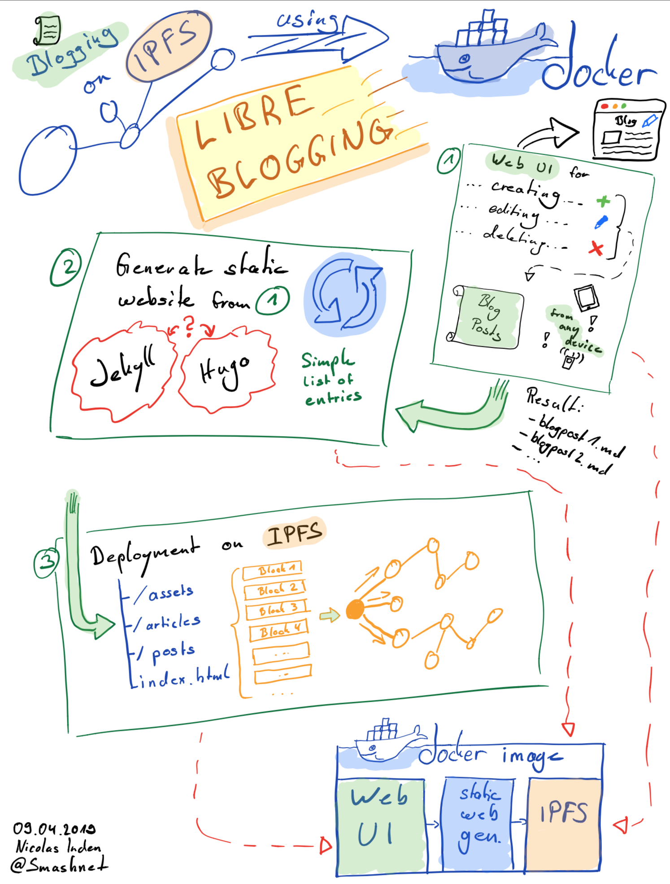

# LibreBlogging
Ideas and issue status: https://miro.com/app/board/o9J_kxu6Y1o=/

LibreBlogging is a hassle-free tool that enables you to set up a simple blog on [IPFS](https://ipfs.io) in no time. The benefits of publishing on IPFS are:

* Content is _not censorable_, as content is not hosted in a single place or by a company.
* _Economical_, as you don't need to spend much money on hosting. You just need a small node to run IPFS on.
* _Scalability_, as your content is cached and distributed also by other IPFS users that read your content.

However, from a content creators perspective there are certain things that make publishing on IPFS rather difficult in comparison to regular blogging platforms:

* Your content is not addressed using handy domains, but through hashes that look like this: `QmTPixNxp6y3iWs2i5BTcv6EzNsX3MaEty1Yys2Nm4W8JD`
* Every time you add or change content, you get a new or changed hash *sigh*
* If you want an immutable address for your blog for sharing you can have one, the [IPNS](https://ipfs.io/ipns/docs.ipfs.io/guides/concepts/ipns/) hash of your node. However, that's still a hash...
* Everytime your blog changes, your blog root will have a new hash that needs to be published to IPNS.

With LibreBlogging we try to come over these hassles and make it simple and easy to have a blog on IPFS while staying as decentralized as possible.

## What is it about?

